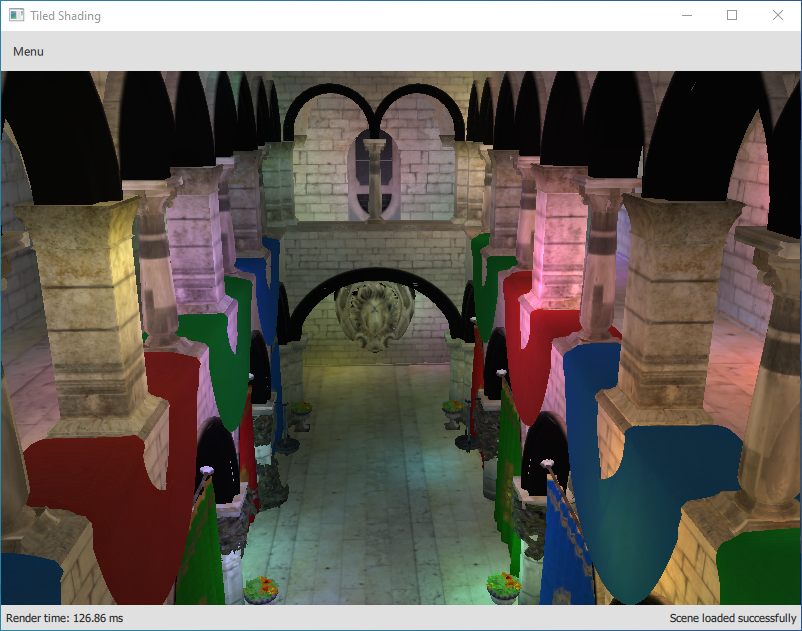
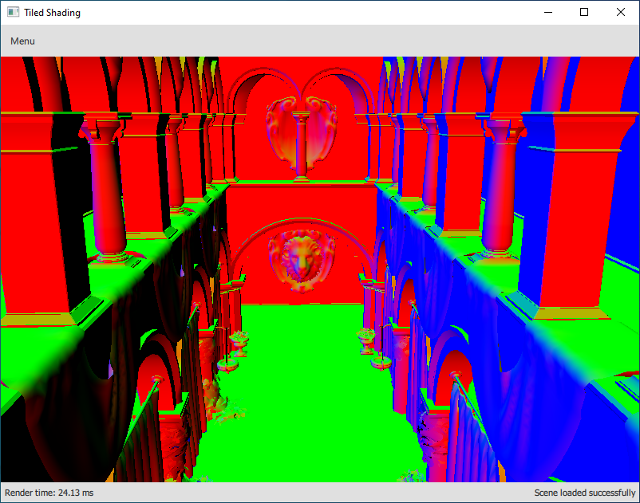
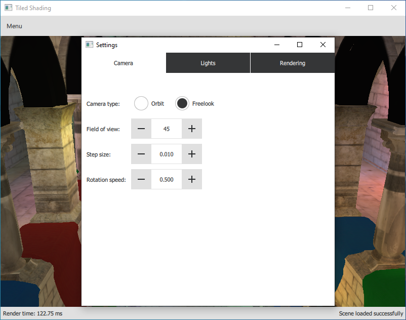
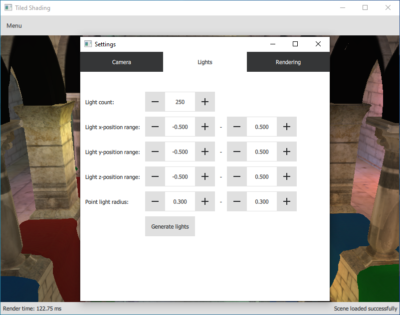
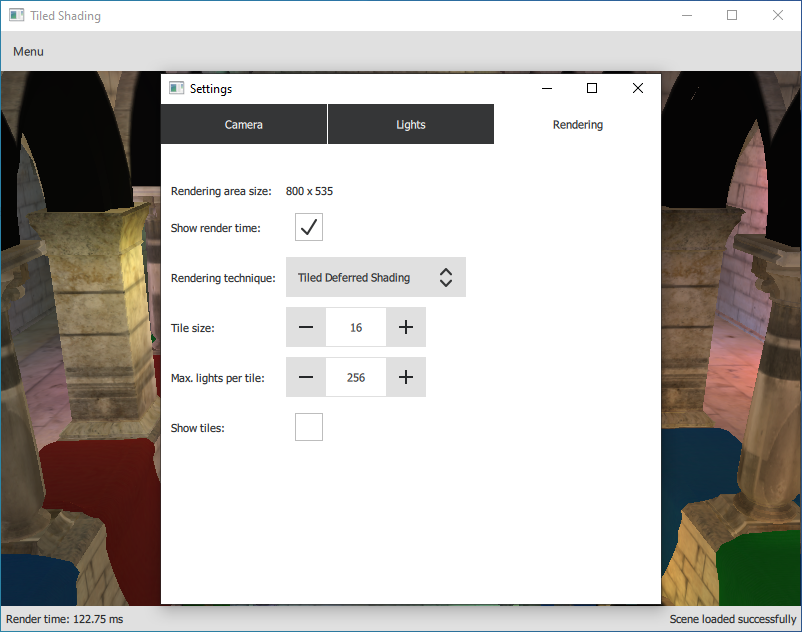

# Tiled Shading

Application demonstrating the Tiled Shading rendering technique: http://www.cse.chalmers.se/~uffe/tiled_shading_preprint.pdf

### External Libraries

- Qt5
- glm
- Assimp 
- GPUEngine: https://github.com/Rendering-FIT/GPUEngine/tree/6d35d13892ee13859772ff133b351a4d0841ffa5
  - Required packages: geGL, geSG, geUtil 
  
### Features:
- can load 3D scenes from files and display them 
- can populate the scene with large amount of randomized lights
- implemented rendering techniques:
  - Forward shading
  - Deferred shading
  - Tiled deferred shading (uses compute shaders)
- can visualize the G-Buffer and the tiles
- Orbit and Freelook camera

### Images:

Sponza scene with many lights:

Normals in the G-Buffer:

GUI:

