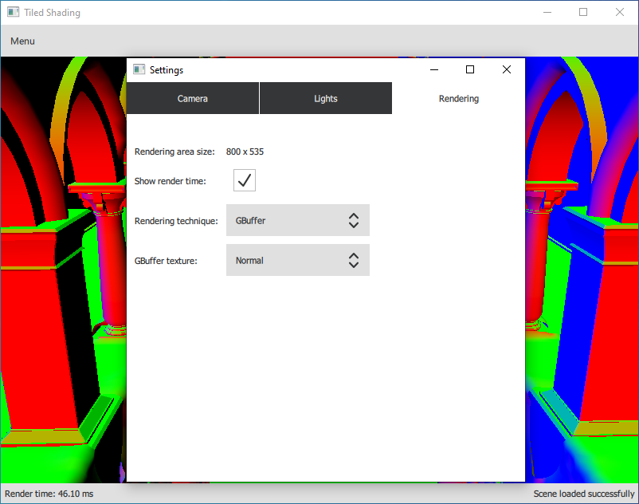

# Tiled Shading

Application demonstrating the Forward Shading, Deferred Shading and Tiled Deferred Shading rendering techniques.

It is based on this paper: <a href="doc/tiled_shading_preprint.pdf">tiled_shading_preprint.pdf</a>

### External Libraries

- Qt5
- Assimp 
- glm
- GPUEngine: https://github.com/Rendering-FIT/GPUEngine/tree/6d35d13892ee13859772ff133b351a4d0841ffa5
  - Required packages: geGL, geSG, geUtil 
  
### Features:
- QML GUI
- can load 3D scenes from files and display them 
- can populate the scene with large amount of randomized lights
- implemented rendering techniques:
  - Forward Shading
  - Deferred Shading
  - Tiled Deferred Shading (uses compute shaders)
- can visualize the G-Buffer and the tiles
- Orbit and Freelook camera

### Images:

Sponza scene with many lights:

Normals in the G-Buffer:

QML GUI:

